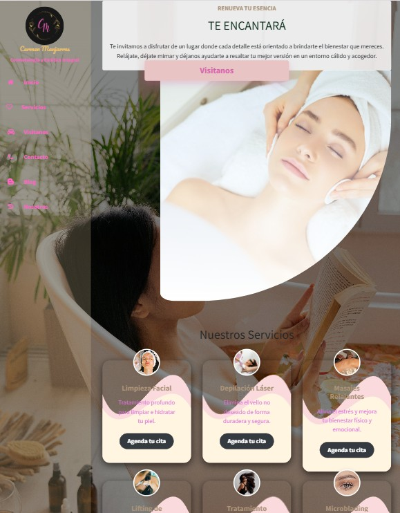

# 🌸 WebEmpresa - Sitio SPA con Django

Bienvenido a **WebEmpresa**, un proyecto web profesional desarrollado con **Django 5**, enfocado en la presentación de un centro de bienestar y spa. Este sitio incluye blog, formulario de contacto, servicios personalizados y un diseño estético con efectos visuales.

---

## ✨ Características

- Página de inicio con diseño atractivo y botones personalizados
- Blog con entradas dinámicas
- Formulario de contacto funcional con envío de emails
- Admin de Django personalizado
- Contenido administrable desde el panel
- Sistema de plantillas extendible
- Uso de `ckeditor` para edición enriquecida
- Integración de `SMTP` para envíos reales de correo
- Animaciones CSS y botones únicos para experiencia de usuario

---

## 🛠 Tecnologías usadas

- **Python 3**
- **Django 5.1**
- **HTML5 + CSS3 + Bootstrap**
- **SQLite3**
- **CKEditor**
- **MailerSend SMTP**

---

## 🚀 Cómo ejecutar el proyecto localmente

### 1. Clona el repositorio

```bash
git clone https://github.com/Lilisp16/webempresa.git
cd webempresa


2. Crea y activa un entorno virtual
python -m venv venv
source venv/bin/activate  # En Windows: venv\Scripts\activate


3. Instala las dependencias

pip install -r requirements.txt


4. Crea un archivo .env

SECRET_KEY=tu_clave
DEBUG=True
EMAIL_HOST_USER=tu_correo
EMAIL_HOST_PASSWORD=tu_contraseña

5. Aplica migraciones y ejecuta

python manage.py migrate
python manage.py runserver


### Página principal



⚠️ Nota de seguridad
Este proyecto está en modo de desarrollo (DEBUG=True) y usa SQLite.
Para producción, se recomienda cambiar a PostgreSQL y configurar correctamente los entornos.